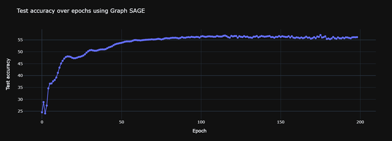

# Community Detection on OGBN-ArXiv Dataset

## Introduction
This repository contains the code and results of my Machine Learning on Graphs course project, where I applied various community detection methods on the OGBN-ArXiv dataset. 
## Dataset
The dataset that I used for this project is the OGBN-ArXiv dataset, which is part of the Open Graph Benchmark (OGB) collection. The OGBN-ArXiv dataset is a large-scale citation network of arXiv papers, where each node is an arXiv paper and each directed edge indicates that one paper cites another one. Each paper has a 128-dimensional feature vector obtained by averaging the embeddings of words in its title and abstract. Each paper also has a year attribute that indicates when it was published. The goal is to predict the category of the papers based on the network structure and the node features.

The OGBN-ArXiv dataset has some distinctive features compared to other graph models, such as the Erdős–Rényi (ER) model and Watts–Strogatz (WS) model. The OGBN-ArXiv dataset is directed, while the ER and WS models are undirected. The OGBN-ArXiv dataset has node features and node labels, while the ER and WS models do not have any node attributes. The OGBN-ArXiv dataset has a high average clustering coefficient of 0.12, while the ER model has an even lower average clustering coefficient of p, where p is the edge probability, and the WS model has a high average clustering coefficient that depends on the rewiring probability and the initial lattice structure. The OGBN-ArXiv dataset has an estimated diameter of 25, while the ER model has a small expected diameter of O(log n), where n is the number of nodes, and the WS model has a small expected diameter that decreases with increasing rewiring probability.

The dataset splitting is based on the time of publication, such that the training set contains papers published before 2017, the validation set contains papers published in 2017, and the test set contains papers published after 2017.  The prediction task is to predict the primary category of the arXiv papers, which is formulated as a 40-class classification problem. The categories are manually determined by the paper's authors and arXiv moderators.

Some statistics of the dataset are shown in the table below:

| Statistic | Value |
| --- | --- |
| Number of nodes | 169343 |
| Number of edges | 1166243 |
| Average in/out degree | 6.89 |
| Average clustering coefficient | 0.12 |
| Strongly connected | No |
| Number of strongly connected components | 141223 |
| Largest strongly connected component size | 23164 |
| Weakly connected | Yes |
| Largest weakly connected component size | 169343 |
| Number of attracting components | 17647 |
| Largest attracting component size | 9 |
| Estimated diameter | 25 
## Methods

I used the following methods for community detection:

### Ready-made Functions in NetworkX

First, the first idea I had for community detection was to use ready-made functions in the NetworkX library, which we only had to give the graph as input, and it separated the communities from one another for us, but the problem with this library was this. whose functions were not optimally implemented (they were not executed on the GPU or in parallel on the CPU), so it was here that after 13 hours of running the algorithm, Louvain did not reach a result on my graph, and I realized that my graph should use a more optimal algorithm due to its high volume. However, with a little research, I realized that Louvain is one of the fastest algorithms for community detection, and most algorithms in terms of time are slower than this algorithm. After trying some other algorithms and not getting an answer after a while, I decided to do a sampling of my graph and increase the number of nodes from more than 160000 to about 1000 nodes. However, with the sampling of graphs, I had many problems, and after reading some articles about graph sampling with algorithms, I got acquainted with Forest fire sampling with landmarks and implemented it in my code.

### Forest Fire Sampling with Landmarks
This algorithm works in such a way that we give it several points as a starting point, then start from each of the points, then add each of the neighbors to the samples with probability p, and then each of the neighbors We add the selected neighbors to the samples with probability p and continue this process. I chose the starting points based on the population of each community in that community, so we have several sampling points from each community, which gives us a guaranteed number of samples from all communities, and also because the diameter of our network is almost the same. The previous network remains, and the amount of clustering coefficient remains almost constant due to the local operation at each of the starting points.
It was here that on the graph obtained from the samples, again, the algorithm Louvain didn't work after more than 7 hours, and I thought of parallelizing the implementation of this algorithm.

### Using Entire Graph with Optimaly Implemented Functions:
 
Then I got acquainted with the cugraph library, whose algorithm runs Louvain on the GPU. Then, with this library, after a short period, I was able to get the output of the Louvain algorithm not only on the sample graph but also on the entire graph. I also got acquainted with the Fluid Communities algorithm, which was implemented in the same NetworkX library, but it worked as an iteration, which allowed me to reach the answer for the entire graph after a few minutes. After using these algorithms, when I used the evaluator related to OGB, I reached an accuracy percentage below one percent. In the dummy classifier mode, I reached 2.5% accuracy, which was strange to me because I got below 1% accuracy. After a closer examination, I realized that, for example, our algorithm outputs a community as community number 3, and our labels in the dataset recognize it as community number 24, so this is where I had to make an evaluator myself.

### The First Evaluator (Simple Evaluator):
In this part, I first created a simple evaluator that worked in a greedy manner, selected one of the communities at each stage, and selected the community from the other side that has the largest number of members in common with our community, and this matches two with each other. But a very big problem that this algorithm had was that if a small community on the one hand, had the most similarity with a huge community on the other hand, and that large community had a large similarity with a large community on the other hand, we greedily matched the small community with the big community and did not achieve a good percentage.

### Second Evaluator (Stable Matching-Based Evaluator):
Then suddenly an algorithm came to mind from the game theory course, and that algorithm was stable matching. So I was inspired by this algorithm, and for all the communities that were predicted by the algorithm, I did a ranking based on the amount of sharing with the communities that were specified based on the labels in the dataset, and I did the same for the communities that I did the obtained datasets and ranked the algorithmic communities for each one.
Then I ran the stable matching algorithm on these so that each community is similar to one from the other side. Also, every time I ran this algorithm twice, once I placed the recommender in the communities obtained from the dataset, and once again I placed the recommender in the communities obtained from the algorithm, and between these two modes, I chose the mode that had the highest value. It will create similarity for me in the end (I got the maximum between the similarity percentages of the output of these two). Finally, I will determine the accuracy percentage of the algorithm. The reason why I ran the algorithm twice with different proposers was that I knew that in the stable matching algorithm, the proposer reaches the best possible pair and the recipient of the proposal reaches the worst possible pair, and our outputs in these two cases are different. So, by running this algorithm twice, I have solved this problem to some extent, and I have chosen the better mode.
Relevant results:
| Method | Stable Matching Evaluator | Simple Evaluator |
| --- | --- | --- |
| Louvain | 16.07% | 0.39% |
| Fluid | 16.28% | 13.09% |

But again, these accuracy values are low, so in the next phase of the project, I was looking for embeddings from the nodes and running algorithms on the embeddings in the hope of higher accuracy percentages.

### Random Walk Methods
I implemented the Node2Vec and DeepWalk algorithms, both of which generate node embeddings through random walks on the network, followed by the application of a word2Vec model to the resulting sequences of nodes. These methods provide control over the exploration-exploitation trade-off during random walks. Node2Vec allows the adjustment of return and in-out parameters, influencing the likelihood of returning to the previous node or visiting a distant one. DeepWalk, on the other hand, utilizes a uniform random walk that does not depend on such parameters. In both cases, word2vec is employed to learn node embeddings capable of capturing the network's structure and features.
I ran Node2Vec in two modes (by adjusting the p and q parameters):
- works more like BFS.
- works more like DFS.
Each one did 30 walks, which were 70 steps long.

Finally, I got an embedding consisting of 128 numbers for each node.

### K-Means Clustering on Node Embeddings
In this step, I tried to use the embeddings that I obtained in the previous step and convert the nodes into clusters using Kmeans in an unsupervised way.
The results obtained are as follows:
| Method | Stable Matching Evaluator
| --- | --- |
| DeepWalk | 21.16% |
| Node2Vec (BFS mode) | 21.85% |
| Node2Vec (DFS mode) | 16.67% |

As we can see, we reached higher percentages.

### Deep Learning on Node Embeddings
By using the labels provided by the dataset, I reached high percentages on embeddings using a supervised neural network. The results of the test data are as follows:
| Method | Test Accuracy
| --- | --- |
| DeepWalk | 63.44% |
| Node2Vec (BFS mode) | 63.55% |
| Node2Vec (DFS mode) | 63.35% |

which was a fundamental advance in achieving higher accuracy.
Also, you can see the progress chart of these three algorithms to reach these percentages in the figures below:

 

 

 

 
### Graph Neural Networks (GNNs)
In this part, I implemented three GCN, GAT, and GraphSAGE algorithms; unfortunately, I was not able to implement the GAT algorithm using GPU due to the large amount of memory required. I trained each algorithm for 200 epochs, but in the first stage, both of them had extremely low percentages (around 1%) of accuracy, and by adding dropouts to their training section, I made their percentages reach significant values. Then I did hyperparameter tuning to make each one work in the best way, and I got the following results in the test set:

| Method | Test Accuracy
| --- | --- |
| GCN | 55.69% |
| GraphSAGE | 56.17% |

You can also see the graph of the progress of these two algorithms to reach these percentages in the figures below:
 

 

 
### Undirected Graph Conversion
Running GNN on the graph in the form of undirected edges:
It was here that I said to myself, What percentages do these algorithms produce on the graph with non-directional edges? At first, I thought they would produce lower percentages, but after a run, I saw that if we consider the edges of our graph as non-directed, the accuracy percentage of the models increases:
| Method | Test Accuracy
| --- | --- |
| GCN | 68.93% |
| GraphSAGE | 71.53% |

You can also see the graph of the progress of these two algorithms to reach these percentages in the figures below:
 

 

 
The reason for this increase in accuracy is that:
1. Our relationships become simpler; previously, if a node had received edges from another node, we hardly noticed this in the embedding of that node, but by removing the direction of this relationship, it has become much easier.
2. The connectivity of our graph increases. Previously, there might not have been a path between two nodes, but by removing the direction between those two nodes, a path can be found.
3. If the edges are undirected, then our adjacency matrix becomes symmetric.

## Results

Finally, I came and drew a diagram of these seven deep learning methods, where I distinguished each method from the rest with a color.

 

 

| Method | Accuracy
| --- | --- | 
| Louvain | 16.07% |
| Fluid | 16.28% |
| DeepWalk (K-Means) | 21.16% |
| Node2Vec (BFS mode) (K-Means) | 21.85% |
| Node2Vec (DFS mode) (K-Means) | 16.67% |
| DeepWalk (Deep Learning) | 63.44% |
| Node2Vec (BFS mode) (Deep Learning) | 63.55% |
| Node2Vec (DFS mode) (Deep Learning) | 63.35% |
| GCN (Directed Graph) | 55.69% |
| GraphSAGE (Directed Graph) | 56.17% |
| GCN (Undirected Graph) | 68.93% |
| GraphSAGE (Undirected Graph) | 71.53% |

## Future Work

Some possible directions for future work are:
I made this part because I had other ideas that I couldn't implement due to hardware limitations or a lack of time to implement them:
- Use of graphlets: I tried hard to get graphlets of length 3, but due to the large volume of the adjacency matrix dataset, in sparse mode, it was about 50 GBs, and neither RAM nor GPU memory had this amount of memory. I wanted to use graphlets next to node features and reach higher percentages.
- Using node features along with node embeddings obtained from random walks for neural network models.
- Using node embeddings that were the result of a random walk on a graph with undirected edges.
